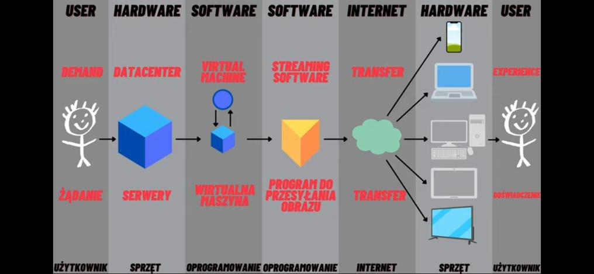
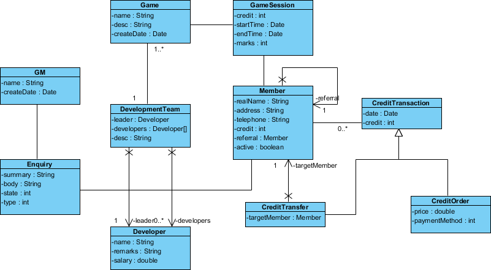
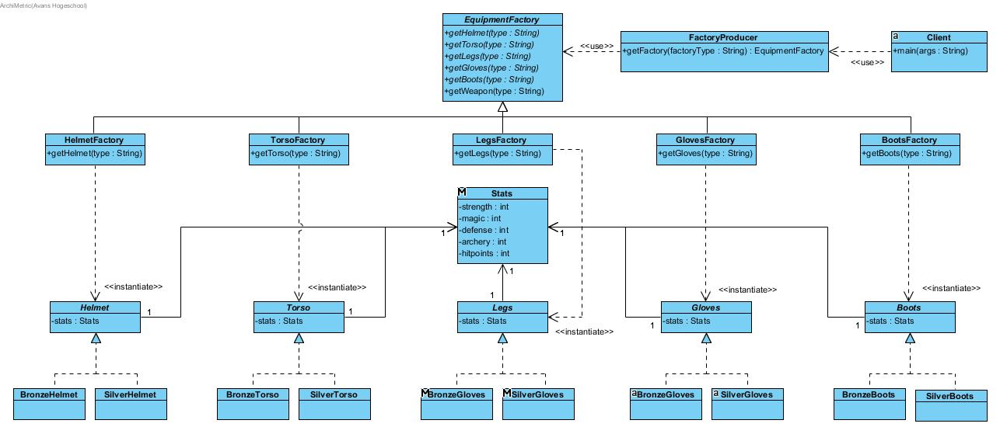

# Specyfikacja wymagań John Wick The Game (JWTG)

JWTG jest projektem gry wieloosobowej mającej na celu zabić każdą sekundę nudy.Jest to grą typu RPG w której gracz może stać się słynnym zabójcą z ołówkiem w ręku. Cel gracza jest prosty stać się legendą i zastraszać innych. Projekt zakłada poruszanie się po świecie w czasie rzeczywistym świecie generowantm przez serwer oraz walki turowe z NPC-ami lub innymi graczami.


## Spis treści

[TOC]
## Architektura gry

Opierać się będzie na połączeniu klient-serwer. Użytkownik będzie miał  możliwość poruszania się po interfejsie graficznym, świecie wygenerowanym przez serwer.  Klient będzie interfejsem do serwera jego głównymi cechami będą takie elementy jak:

- Możliwość rejestracji i logowania do bazy danych by stworzyć swój unikatowy profil
- Wyświetlanie stanu postaci na świecie oraz możliwość edytowania jego wyglądu
- Przechwytywanie sygnałów z klawiatury oraz myszki 


Serwer natomiast będzie symulował cały świat, a więc będzie obsługiwał elementy takie jak:

- Interakcje graczy z otoczeniem świata 
- Zarządzanie misjami
- Przechowywanie informacji o stanie postaci (jej poziomie życia, ekwipunku, stanie pieniędzy)
- Zarządzenie kontami graczy
- Przekazywanie klientom stanu własnej postaci oraz otoczenia

## Technologie
Klient będzie pisany w języku C++ oraz QT. Obsługi komunikacji z serwerem oraz interfejsem graficznym zostanie wykorzystana biblioteka SFML.

Serwer zostanie stworzony za pomocą języka Python. Obsługę połączeń obsłuży wbudowana biblioteka `socket`.

Do łączenia się przez internet zostanie wykorzystany protokół TCP.

Ponad to projekt będzie przygotowany i zastosowany w ramach gry w chmurze. 
Gdzie przebieg grania w grę będzie polegał na tym, że gra uruchamiana jest na zewnętrznym superkomputerze, który zajmuje się wszystkimi obliczeniami i wyświetlaniem grafiki gry, która następnie jest przesyłana do odbiorcy w formie obrazu i dźwięku. Gracz steruje kontrolerem i wysyła informacje zwrotne do serwera, który odsyła kolejne zmiany na ekranie.

Niezbędną rzeczy by móc grać w grę będzie za tem dobre połączenie sieciowe. A sam sprzęt nie będzie stanowił problemu.




## Działania możliwe do podjęcia w grze

Ze względu na główne założenia przy tworzeniu gry, oraz jej klimat i fabuła umieszczona w świecie Johna Wicka. Zadaniem gracza będzie przyjmowanie zleceń. Odbywać się będzie ono na przez randomowe przychodzone połączenia od NPC-ów, zgłaszanie się na tablicy zleceń, szukaniu zleceń w klubach, sklepach, dilerach itp. oraz przez rozmowy z innymi graczami.
Gracz będzie miał możliwość zakupu nowej broni i uzupełnienia zdrowia w wyznaczonych miejscach na mapie. Na tej samej zasadzie będzie możliwe podjęcie walki z postacią sterowaną przez komputer lub innym graczem. Wykonanie zlecenia będzie skutkowało uzyskaniem punktów RP, XP oraz kredytów. Punkty RP umożliwiają dostęp do coraz to trudniejszych misjii, punkkty XP dostarczają możliwości rozwijania postaci w kilku gałęziach rozwoju (szybkość, inteligencja, wytrzymałość) oraz będzie odblokowywała bronie, pojazdy, domy zaś kredyty umożliwią kupno broni domów samochodów, zwierząt,przekąsek, zapłaceniu łapówki czy też mandatu albo podzieleniu się kredytami z potrzbującymi.








Scenariusz tworzenia konta
=============

Po wypełnieniu formularza użytkownik staje się częścią projektu i dostaje pełne konto wraz ze swoją postacią.

User registration
-----------
* Navigate to the configuration page
* User must type e-mail, login and password
* Creating account in database 
* Confirmation by e-mail
* Log into account


## Cel pierwszej działającej wersji systemu

- Bezpośrednie połączenie z serwerem 
- Możliwość stworzenia konta
- Załadowanie mapy świata z serwera 
- Możliwość przemieszczania się po tym świecie
- Przetestowanie broni, możliwości jazdy,
interakcji z NPC-em lub zwierzakiem.
## Instalacja

Cały program będzie zainstalowany na "superkomputerze" który będzie streamował rozgrywkę dla użytkowników:

Serwer:
Do uruchomienia konieczny będzie Python 

```

cd jwtg\serwer
python Main.py
```

Klient:
Do uruchomienia konieczny jest kompilator języka C++ oraz QT, system budowania kodu CMake.

```

cd jwtg\klient
mkdir build
cmake -S . -B build/
cmake --build build/
cd build
jwtg-game
```


